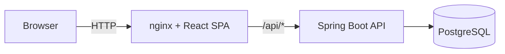

# JobFlow

> Track every job application like a professional — from first contact to final offer.

JobFlow is a full-stack job application tracker built as the term project for the **Continuous Integration and Delivery (CI/CD)** course. It demonstrates a complete, production-style DevOps pipeline: a containerized 3-tier application, automated CI/CD with GitHub Actions, and a full Kubernetes deployment with Deployments, Services, Ingress, a StatefulSet, ConfigMaps, and Secrets.

## ✨ Features

- **Authentication** — registration and login secured with HTTP Basic Auth
- **Kanban pipeline board** — drag-and-drop applications between stages (`Applied → Interview → Offer / Rejected / Withdrawn`), with valid-transition rules enforced on both the client and the server
- **Application detail view** — recruiter contact, salary, location, interview scheduling, notes, and a real status-change timeline
- **Smart dashboard** — KPI cards, a next-interview widget, "Today's Focus" reminders, and a recent-activity feed, all derived client-side from existing data with no extra backend calls
- **Company autocomplete** — suggests existing companies (and their industry) while adding a new application
- **Custom design system** — Tailwind CSS tokens, accessible Radix UI dialogs, Lucide icons

## 🏗️ Architecture



The frontend never calls the backend by absolute URL — it always uses relative paths (`/api/...`). In Docker Compose, nginx transparently proxies those requests to the backend container. In Kubernetes, the Ingress does the same routing at the cluster edge. The same Docker image works unmodified in both environments.

## 🧰 Tech stack

| Layer | Technology |
|---|---|
| Frontend | React, TypeScript, Vite, Tailwind CSS, React Router, @dnd-kit, Radix UI, Axios |
| Backend | Spring Boot 3, Java 21, Spring Security, Spring Data JPA, Flyway, springdoc-openapi |
| Database | PostgreSQL 16 |
| Containers | Docker (multi-stage, non-root images), Docker Compose |
| CI/CD | GitHub Actions (test → build → push to Docker Hub) |
| Orchestration | Kubernetes — Deployment, StatefulSet, Service, Ingress, ConfigMap, Secret, HPA |

## 🚀 Running locally with Docker Compose

```bash
git clone https://github.com/ambarkovateona/job-tracker-kiii.git
cd job-tracker-kiii
```

Create a `.env` file in the project root:
POSTGRES_DB=jobtracker

POSTGRES_USER=postgres

POSTGRES_PASSWORD=postgres

Then:

```bash
docker compose up -d --build
```

| Service | URL |
|---|---|
| App | http://localhost:4000 |
| Backend API docs (Swagger) | http://localhost:4445/swagger-ui.html |
| Database | localhost:1100 |

**Demo account:** `demo@jobtracker.com` / `demo123`

## ☸️ Running on Kubernetes

Tested locally on [k3d](https://k3d.io) (k3s in Docker), which ships with Traefik as its default Ingress controller.

```bash
k3d cluster create jobtracker --api-port 127.0.0.1:6550 \
  -p "8080:80@loadbalancer" -p "8443:443@loadbalancer"

kubectl apply -f k8s/namespace.yaml
kubectl apply -f k8s/
kubectl get all -n jobtracker
```

Open **http://localhost:8080**.

### What gets deployed

| Resource | Purpose |
|---|---|
| `Namespace` | Isolates every project resource (`jobtracker`) |
| `ConfigMap` | Non-sensitive config — DB host, port, name, username |
| `Secret` | Database password |
| `StatefulSet` + headless `Service` | PostgreSQL, with a `PersistentVolumeClaim` for durable storage |
| `Deployment` + `Service` (×2) | Backend (Spring Boot) and frontend (nginx), each with CPU/memory requests and limits |
| `Ingress` | Path-based routing — `/api` → backend service, `/` → frontend service |

## 🔄 CI/CD pipeline

On every push or pull request to `main`, [`.github/workflows/ci-cd.yml`](.github/workflows/ci-cd.yml) runs:

1. **Backend tests** — against a real, ephemeral PostgreSQL service container, not mocked
2. **Frontend** — type-checks and builds the production bundle
3. **Build & push** (only on push to `main`, and only after both jobs above succeed) — builds and pushes both Docker images, tagged `latest` and with the commit SHA, to Docker Hub:
   - [`ambarkovateona/job-tracker-backend`](https://hub.docker.com/r/ambarkovateona/job-tracker-backend)
   - [`ambarkovateona/job-tracker-frontend`](https://hub.docker.com/r/ambarkovateona/job-tracker-frontend)

## 📁 Project structure

```
job-tracker-kiii/
├── backend/             # Spring Boot REST API
├── frontend/            # React + TypeScript SPA
├── k8s/                 # Kubernetes manifests
├── .github/workflows/   # CI/CD pipeline definition
└── docker-compose.yaml  # Local 3-service orchestration
```

## 📖 API documentation

Interactive Swagger UI is available at `/swagger-ui.html` whenever the backend is running (locally or in Docker), with Basic Auth pre-configured as a security scheme.
